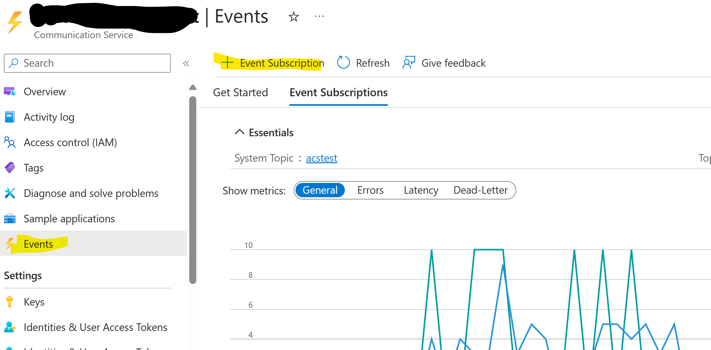
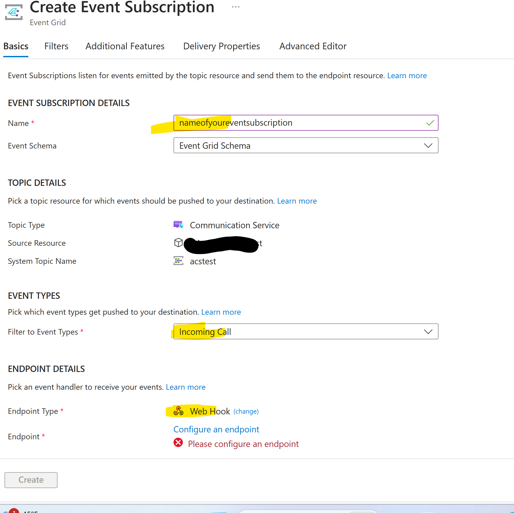
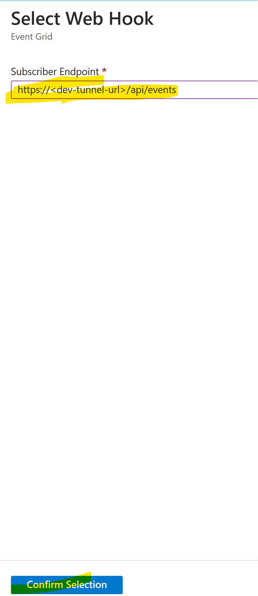
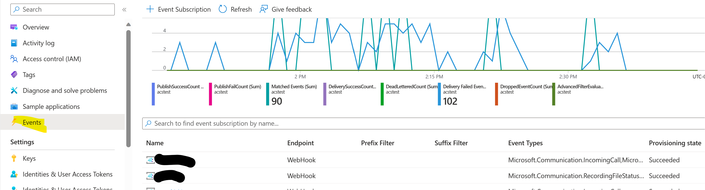

# Incoming Call Recording

Receives the incoming call event, and answer the incoming call, starts the recording, and play text to user and allow user to record the message and then it stops the recording until user disconnect the call. Once the recorded file is available for downloading it will be downloaded to project location

## Features

This project framework provides the following features:
* It starts the websocket
* It accepts the incoming call with media streams enabled
* It plays text to the user.
* It records the user message.
* It downloads the recording file to your project location.

## Getting Started

### Prerequisites

* An Azure account with an active subscription. For details, see [Create an account for free](https://aka.ms/Mech-Azureaccount) 
* Create an Azure Communication Services resource. For details, see [Create an Azure Communication Resource.](https://learn.microsoft.com/en-us/azure/communication-services/quickstarts/create-communication-resource?tabs=windows&pivots=platform-azp) You'll need to record your resource connection string for this sample.
* For local run: Install Azure Dev Tunnels CLI. For details, see [Create and host dev tunnel](https://learn.microsoft.com/en-us/azure/developer/dev-tunnels/get-started?tabs=windows)
* [.NET 7](https://dotnet.microsoft.com/download)
* [Cognitive Service ](https://learn.microsoft.com/en-us/azure/search/search-create-service-portal)

## Setup Instructions

Before running this sample, you'll need to setup the resources above with the following configuration updates:

##### 2. Add a Managed Identity to the ACS Resource that connects to the Cognitive Services resource
Follow the instructions in this [documentation](https://learn.microsoft.com/en-us/azure/communication-services/concepts/call-automation/azure-communication-services-azure-cognitive-services-integration).

##### 3. Add the required API Keys and endpoints
Open the appsettings.json file to configure the following settings:

    
    - `AcsConnectionString`: Azure Communication Service resource's connection string.
    - `CognitiveServiceEndpoint`: The Cognitive Services endpoint
    - `BaseUrl`:  your ngrok url wwhere it points to 8080 port
	- `TranscportUrl`:  your ngrok url wwhere it points to 5001 port

### Setup and host ngrok

You can run multiple tunnels on ngrok by changing ngrok.yml file as follows:

1. Open the ngrok.yml file from a powershell using the command ngrok config edit
2. Update the ngrok.yml file as follows:
    authtoken: xxxxxxxxxxxxxxxxxxxxxxxxxx
    version: "2"
    region: us
    tunnels:
    first:
        addr: 8080
        proto: http 
        host_header: localhost:8080
    second:
        proto: http
        addr: 5001
        host_header: localhost:5001
NOTE: Make sure the "addr:" field has only the port number, not the localhost url.
3. Start all ngrok tunnels configured using the following command on a powershell - ngrok start --all
4. Once you have setup the websocket server, note down the the ngrok url on your server's port as the websocket url in this application for incoming call scenario. Just replace the https:// with wss:// and update in the appsettings.json file.

## Running the application

Best way to test this application, by calling to communication identifier [you can refer this web ui to make call to communication identitifer or acs phone number](https://github.com/Azure-Samples/communication-services-web-calling-tutorial/blob/main/README.md)

1. Provide the ngrok url for port 8080 in the BaseUrl
2. Provide the ngrok url for port 5001 in the TransportUrl
3. Run `dotnet run` to build and run the incoming-call-recording tool
4. Register an EventGrid Webhook for the IncomingCall Event that points to your ngrok url for port 8080. Instructions [here](https://learn.microsoft.com/en-us/azure/communication-services/concepts/call-automation/incoming-call-notification).
   
   - **Step 1** -> Go to your communication service resource in the Azure portal
   - **Step 2** -> Left corner you might see the events and click event subsription on the right
     
     

   - **Step 3** -> Give the Name under the Subscription Details, and provide the system topic name under Topic Details and select **"Incoming Call" & "Recording File Status Updated"** under Event Types, And select the "Web Hook" from the Endpoint Details section
     
   

   - **Step 4** -> Click on Configure an endpoint, provide Subscriber Endpoint to your devtunnel url, and for the events endpoint. ex. **https://<devtunnelurl>/api/events**. And click on the Confirm Selection and Create
     
    

   - **Step 5** -> once its created you will be able to see under the events section of the communication service
   - 
    

   

